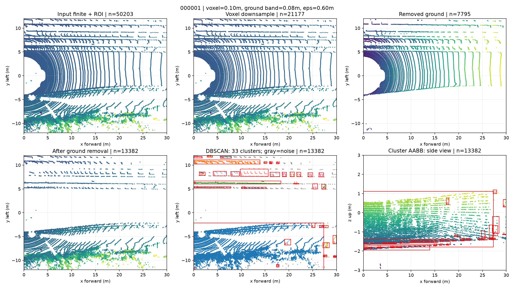
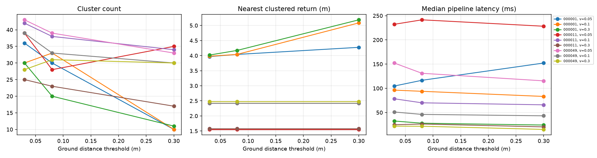
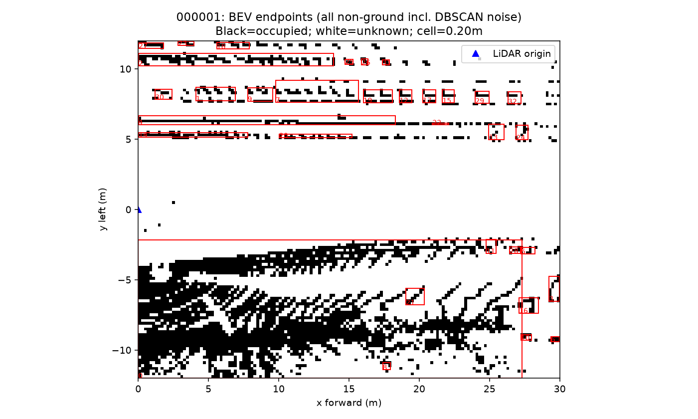
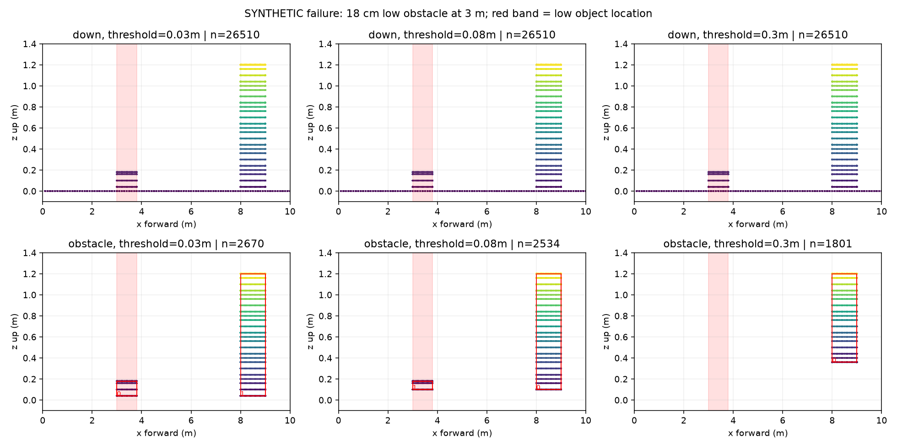

# Báo cáo Day 6: Phát hiện vật cản và nguy cơ mất vật thấp sát đất

- **Họ tên:** Hoàng Văn Nam
- **MSSV:** 2A202602853
- **Lớp:** Track 4 - H209
- **Link repo:** https://github.com/namhv521/day06-2A202602853
- **Topic:** D — Robot/drone obstacle, không dùng deep learning.
- **Dataset:** `data/kitti_mini` cho benchmark thật; cảnh hình học tự sinh `low_scene()` cho failure có kiểm soát.
- **Các frame đã dùng:** `000001`, `000011`, `000049`; `low_scene` không phải frame KITTI.

## 1. Claim

Với vật thấp cao 18 cm cách LiDAR 3 m trong cảnh giả lập, tăng `distance_threshold` từ 3 cm lên 30 cm, giữ voxel 5 cm và DBSCAN cố định, làm mất toàn bộ điểm vật thấp và khiến khoảng cách tới cluster gần nhất tăng từ **3,00 m lên 8,06 m**. Đây là lỗi tiền xử lý; khoảng cách tăng không chứng minh đường đi an toàn.

Trên KITTI, voxel và ngưỡng ground ảnh hưởng số cluster, kích thước, khoảng cách và latency. Số cluster không tương đương số vật thể thật hoặc độ chính xác detection. Bài chọn BEV occupancy cho Advanced, chưa đánh giá precision/recall theo `label_2`.

## 2. Evidence

### Basic: pipeline và ảnh từng bước

`Finite + ROI → voxel_down_sample → segment_plane → ground removal → cluster_dbscan → AABB`.

- Hệ LiDAR: x tiến, y trái, z lên; đơn vị mét. ROI nửa mở x∈[0,30), y∈[-12,12), z∈[-3,3).
- Fit ground trên 35% điểm có z thấp nhất sau voxel; RANSAC 300 iteration, seed 42, `probability=1.0` để tránh early-stop gây biến thiên khi chạy song song.
- Chấp nhận plane lệch trục z không quá 20° và có ít nhất 15% candidate là inlier. Fit không hợp lệ thì giữ mọi điểm, đánh dấu `ground_valid=False`.
- Loại điểm khi khoảng cách vuông góc đến plane ≤ `distance_threshold`. DBSCAN giữ cố định `eps=0.60 m`, `min_points=8`; label -1 là noise.
- AABB min/max/extent x,y,z, số điểm và khoảng cách của **từng cluster** lưu trong `results/obstacle_boxes.csv`. Không phân loại người/xe/pallet.



Baseline voxel 0,10 m, ground 0,08 m: frame `000001` có 33 cluster; `000011` có 38; `000049` có 33. Đủ ảnh pipeline và BEV cho cả ba frame trong `results/figures/`.

### Good: sweep hai tham số

Full factorial voxel∈{0,05; 0,10; 0,30} m × ground∈{0,03; 0,08; 0,30} m × 3 frame = **27 cấu hình**. Bỏ một warm-up mỗi cấu hình, đo thêm **20 lượt**, tổng **540 lượt**. Trong mỗi lát cắt của bảng, giữ một tham số cố định để đánh giá tham số còn lại.

Ví dụ đầy đủ 3×3 cho frame `000001`, làm tròn từ CSV:

| Voxel (m) | Ground (m) | Cluster | Extent trung bình x/y/z (m) | Gần nhất (m) | Latency p50 (ms) | p95 (ms) |
|---:|---:|---:|---|---:|---:|---:|
| 0,05 | 0,03 | 36 | 3,003 / 1,259 / 0,265 | 3,968 | 104,719 | 115,336 |
| 0,05 | 0,08 | 30 | 4,080 / 1,089 / 0,270 | 4,039 | 116,554 | 181,730 |
| 0,05 | 0,30 | 10 | 5,438 / 1,436 / 0,563 | 4,274 | 152,221 | 166,685 |
| 0,10 | 0,03 | 30 | 3,330 / 1,213 / 0,299 | 3,980 | 96,253 | 103,425 |
| 0,10 | 0,08 | 33 | 3,284 / 1,010 / 0,250 | 4,040 | 93,793 | 98,762 |
| 0,10 | 0,30 | 10 | 5,371 / 1,478 / 0,604 | 5,085 | 83,213 | 87,211 |
| 0,30 | 0,03 | 30 | 2,740 / 1,273 / 0,418 | 4,018 | 32,423 | 39,423 |
| 0,30 | 0,08 | 20 | 2,587 / 1,319 / 0,527 | 4,172 | 27,907 | 38,769 |
| 0,30 | 0,30 | 11 | 4,574 / 1,485 / 0,923 | 5,186 | 24,105 | 35,827 |



`results/obstacle_sweep.csv` chứa 27 hàng; `obstacle_runs.csv` chứa 540 lượt đo và latency voxel/ground/cluster; `obstacle_manifest.json` ghi cấu hình/môi trường/phạm vi đo. CPU Intel Core i5-12450H, Windows 11, Python 3.12.9, Open3D 0.20.0, NumPy 2.5.3; không dùng GPU. Đo bằng `perf_counter`, gồm finite/ROI, voxel, RANSAC, ground removal, DBSCAN và AABB; **không gồm đọc dữ liệu, vẽ ảnh hay occupancy**. p95 nội suy từ 20 mẫu chưa đại diện cho tải vận hành dài hạn.

`nearest_m` là min √(x²+y²) của **điểm thuộc cluster**, tính từ gốc LiDAR, không phải tâm box hoặc khoảng hở tới thân robot. `nearest_return_m` tính cả noise còn lại; không cluster thì `nearest_m=NaN`. Baseline `000001`: cluster gần nhất 4,040 m nhưng vẫn có return không-ground ở 1,592 m; không được bỏ qua chỉ vì DBSCAN gắn noise. Kích thước trong bảng là trung bình extent của tất cả cluster, không phải kích thước GT.

### Advanced: BEV occupancy



Grid 0,20 m/cell, shape 120×150; row=y từ -12 m, column=x từ 0 m. **Đen=có endpoint không-ground; trắng=chưa biết**, chưa ray tracing vùng trống. BEV giữ tất cả điểm không-ground, kể cả noise; box đỏ là AABB. `results/occupancy_<frame>.npy` lưu grid từng frame. BEV không khôi phục được điểm đã bị ground removal xóa nhầm.

## 3. Failure case



Cảnh **tự sinh**: ground z=0, vật thấp 18 cm tại x∈[3;3,8] m, y∈[-0,3;0,3] m; vật cao 1,2 m tại x∈[8;9] m, y∈[1;2] m. Đây là hình học đơn giản, chưa mô phỏng đủ quét LiDAR/che khuất; không phải GT pallet/người của KITTI. Code tạo cảnh trong `src/obstacles.py`; số liệu do chạy thật sinh ra.

| Ground (m) | Điểm vật thấp sau voxel | Điểm còn sau ground removal | Phát hiện vật thấp | Cluster | Gần nhất (m) |
|---:|---:|---:|---|---:|---:|
| 0,03 | 389 | 389 | Có | 2 | 3,000 |
| 0,08 | 389 | 333 | Có | 2 | 3,000 |
| 0,30 | 389 | 0 | Không | 1 | 8,062 |

Bằng chứng gốc: `results/low_obstacle_failure.csv`. Dải ground 30 cm bao phủ vật cao 18 cm nên xóa điểm vật trước DBSCAN. Lỗi **Preprocess**, kéo theo lỗi **Metric** nếu coi khoảng cách cluster tăng là an toàn hơn. Giám sát điểm bị loại ở vùng gần, trạng thái plane, và chênh lệch khoảng cách cluster với toàn bộ return.

Trong ảnh KITTI baseline còn có các dải điểm gần ground và cluster dài: một plane không mô tả hết mặt đường/địa hình. Không diễn giải mỗi cluster là một vật độc lập; ground một plane và DBSCAN cố định là baseline có giới hạn.

## 4. Khuyến nghị nếu triển khai thật

**Trả lời thuyết trình:** `distance_threshold` quá lớn trực tiếp làm mất vật thấp sát đất. Voxel lớn có thể gộp điểm vật với ground, dịch centroid và làm số điểm dưới `min_points`. `min_points` quá lớn/`eps` quá nhỏ có thể biến vật nhỏ thành noise; `eps` quá lớn gộp vật gần nhau. Hai tham số DBSCAN chưa được sweep trong bài; các nhận xét này giải thích cơ chế và cần kiểm chứng thêm.

Robot trong kho chọn ngưỡng ground theo nhiễu cảm biến, sàn dốc và **vật thấp nhất cần phát hiện**. Có thể bắt đầu thử voxel 5–10 cm, ground 3–8 cm rồi đánh giá recall vật thấp trên dữ liệu kho thật; chưa phải cấu hình vận hành được xác nhận. Voxel 30 cm nhanh hơn trong nhiều cấu hình KITTI nhưng có nguy cơ mất hình học nhỏ. Không chọn chỉ theo tốc độ hoặc số cluster giảm.

Giữ noise trong occupancy; inflation theo kích thước robot/khoảng dừng và giữ unknown ở ô chưa quan sát. Trước vận hành cần kiểm tra sàn dốc/nhiều plane, che khuất, chuyển động, timestamp; log plane validity, điểm bị loại, nearest return/cluster và p95 latency. Drone cần khoảng hở theo z vì BEV 2D không phân biệt vật trên/dưới đường bay. Chưa chứng minh an toàn vận hành thực.

## 5. Cách chạy lại

Từ gốc repo, Python 3.12, PowerShell:

```powershell
python -m venv .venv
.venv/Scripts/python.exe -m pip install -r src/requirements-obstacles.txt
.venv/Scripts/python.exe tools/verify_data.py --data-root data/kitti_mini
.venv/Scripts/python.exe -m unittest src.test_obstacles -v
.venv/Scripts/python.exe -m src.obstacles --data-root data/kitti_mini --frames 000001 000011 000049 --repeats 20
.venv/Scripts/python.exe tools/check_submission.py
```

Có `.venv` thì bỏ bước tạo. CLI `--help` mô tả các tùy chọn; chạy nhanh dùng `--repeats 3` nhưng benchmark trong báo cáo dùng 20. Seed và budget RANSAC đầy đủ cho cùng counts/nearest/ground giữa 20 lượt trên môi trường ghi nhận; thay môi trường có thể đổi hình học, latency thay đổi theo tải máy. Dependencies nền theo version floor của repo; đối chiếu môi trường trong manifest.

Topic D không dùng camera nên được bỏ qua TODO projection theo CP2 của `CHECKPOINTS.md`. Học viên cần bổ sung mã lớp cụ thể trước khi nộp. Script submission chỉ kiểm tra hình thức, không xác nhận nội dung/private repo/collaborator/LMS.

## 6. Khai báo sử dụng AI

| Công cụ | Dùng cho việc gì | Kiểm chứng đã thực hiện |
|---|---|---|
| OpenAI Codex | Viết pipeline/tests, chạy benchmark, tạo ảnh và soạn báo cáo | Agent chạy KITTI thật, 540 lượt đo; đối chiếu CSV, test vật thấp/NaN/ROI/occupancy/repeat geometry và kiểm tra ảnh. Học viên cần tự chạy lại, đọc code và giải thích khi vấn đáp. |

Tham khảo API: [Open3D point cloud tutorial](https://www.open3d.org/docs/release/tutorial/geometry/pointcloud.html). Reader và KITTI mini do repo đề bài cung cấp. Không dùng deep learning/checkpoint hoặc số liệu của học viên khác. Không tuyên bố học viên đã tự kiểm chứng khi chưa được xác nhận.
